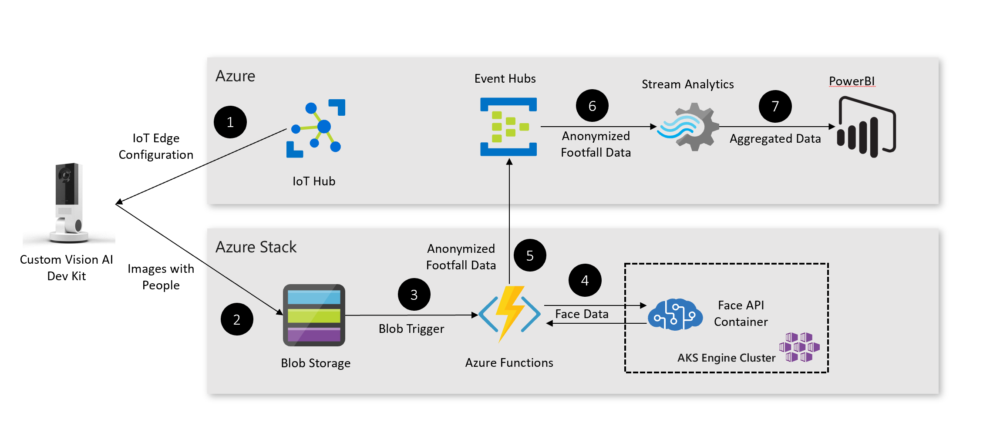
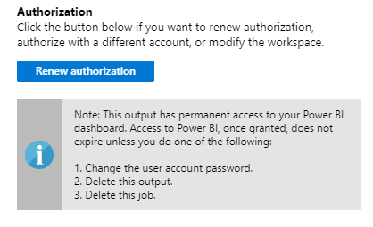

# Deploy a Footfall Analysis Solution
This article describes how to deploy a solution generates insights from
real world actions by using Azure, Azure Stack, and the Custom Vision AI
Dev Kit.

In this article you learn how to:

  - Deploy Cloud Native Application Bundles at the edge. To learn about
    CNAB and Porter, [go here](https://porter.sh/).

  - Deploy an application that spans cloud boundaries.

  - Use the Custom Vision AI Dev Kit for inference at the edge.



Learn more about this solution
[here](https://docs.microsoft.com/en-us/azure-stack/user/hybrid-solution-retail-footfall-detection?view=azs-1908).

## Prerequisites

Before you begin, make sure you have:

  - An Azure Stack Development Kit or Azure Stack Integrated System.
    
      - The Azure Stack should have Azure App Service installed.
    
      - You should have a subscription on the Azure Stack with App
        Service and Storage Quota.

  - An Azure subscription
    
      - If you don't have an Azure subscription, create a free account
        before you begin.

  - Two service principals
    
      - One configured for Azure, with access to the Azure Subscription.
    
      - One configured for Azure Stack, with access to the Azure Stack
        subscription.
    
      - To learn more about creating service principals, go
        [here](https://docs.microsoft.com/en-us/cli/azure/create-an-azure-service-principal-azure-cli?view=azure-cli-latest#create-a-service-principal).

  - Azure Cognitive Services deployed in Azure, or Azure Stack.
    
      - To learn more about Cognitive Services[, go
        here](https://azure.microsoft.com/en-us/services/cognitive-services/).
    
      - [Use these
        instructions](https://docs.microsoft.com/en-us/azure-stack/user/azure-stack-solution-template-cognitive-services?view=azs-1908)
        to deploy Cognitive Services on Azure Stack. You’ll need to sign
        up for a private preview.

  - An unconfigured Azure Custom Vision AI Dev Kit. To learn more or to
    get one[, go here](https://azure.github.io/Vision-AI-DevKit-Pages/).

  - A PowerBI Account.

  - The following development resources:
    
      - Azure CLI 2.0
    
      - Docker CE.
    
      - Porter.
    
      - Visual Studio Code.
    
      - Azure IoT Tools for Visual Studio Code.
    
      - Python extension for Visual Studio Code.
    
      - Python

## Get the Code

1.  Clone or download the code.

> <https://github.com/azure-samples/azure-intelligent-edge-patterns>

## Deploy the Cloud Application

Use the Porter CLI to generate a credential set, then deploy the cloud
application.

1.  Porter will generate a set of credentials that will automate
    deployment of the application. You’ll need:
    
    - Azure Service Principal ID
    - Azure Service Principal Key
    - Azure Service Principal Tenant DNS
    - Azure Subscription ID
    - Azure Stack Service Principal ID
    - Azure Stack Service Principal Key
    - Azure Stack Service Principal Tenant DNS
    - Azure Stack Subscription ID
    - Face API Endpoint
    - Face API Key

2.  Run the credential generation process and follow the prompts.

```
porter creds generate --tag intelligentedge/footfall-cloud-deployment:0.1.0
```
3.  Porter also requires a set of insecure parameters to run. Create a
    text file and enter the following text. Ask your Azure Stack’s
    administrator if you don’t know some of the required values.

> The resource suffix should be a unique string of letters and numbers,
> no longer than 8 characters, to ensure that your deployment’s
> resources have unique names across Azure.

```
azure_stack_tenant_arm="Your Azure Stack Tenant Endpoint"
azure_stack_storage_suffix="Your Azure Stack Storage Suffix"
azure_stack_keyvault_suffix="Your Azure Stack KeyVault Suffix"
resource_suffix="Any unique string here."
azure_location="Any Azure region here."
azure_stack_location="Your Azure Stack’s location identifier here."
powerbi_display_name="Your first and last name here."
powerbi_principal_name="Your PowerBI Account’s email address here."
```
Save the text file and make a note of its path.

4.  You’re now prepared to deploy the cloud application with Porter. Run
    the deployment command and watch as resources are deployed to Azure
    and Azure Stack.
```
porter install footfall-cloud –tag intelligentedge/footfall-cloud-deployment:0.1.0 –creds footfall-cloud-deployment –param-file "path-to-cloud-parameters-file.txt"
```
5.  Once deployment is complete, make a note of the camera’s connection
    string, image storage account connection string, and the resource
    group names.

## Prepare the Custom Vision AI Dev Kit

1.  Set up the Custom Vision AI Dev Kit as [shown
    here](https://azure.github.io/Vision-AI-DevKit-Pages/docs/quick_start/),
    using the connection string returned from the previous step.
2.  Once setup has completed, deploy the camera application.

# Deploy the Camera Application

Use the Porter CLI to generate a credential set, then deploy the camera
application.

1.  Porter will generate a set of credentials that will automate
    deployment of the application. You’ll need:
    
    -  Azure Service Principal ID
    -  Azure Service Principal Key
    -  Azure Service Principal Tenant DNS
    -  Azure Subscription ID
    -  Image Storage Account Connection String

2.  Run the credential generation process and follow the prompts. Learn
    more about Porter’s credential generation process.
```
porter creds generate --tag intelligentedge/footfall-camera-deployment:0.1.0
```
3.  Porter also requires a set of insecure parameters to run. Create a
    text file and enter the following text. Ask your Azure Stack’s
    administrator if you don’t know some of the required values.

> The deployment suffix should be a unique string of letters and
> numbers, no longer than 8 characters, to ensure that your deployment’s
> resources have unique names across Azure.

```
iot_hub_name="Name of the IoT Hub deployed"
deployment_suffix="Unique string here"
```
Save the text file and make a note of its path.

4.  You’re now prepared to deploy the camera application with Porter.
    Run the deployment command and watch as the IoT Edge deployment is
    created.

```
porter install footfall-camera –tag intelligentedge/footfall-camera-deployment:0.1.0 –creds footfall-camera-deployment –param-file "path-to-camera-parameters-file.txt"
```

5.  Verify that the camera’s deployment is complete by viewing the
    camera feed at [https://camera-ip:3000/](https://camera-ip:3000/). This may take up to ten minutes.

## Configure Stream Analytics

Now that data is flowing to Stream Analytics from the camera, we need to
manually authorize it to communicate with PowerBI.

1.  From the Azure portal open **All Resources**, and the
    *process-footfall\[yoursuffix\]* job.

2.  In the **Job Topology** section of the Stream Analytics job pane,
    select the **Outputs** option.

3.  Select the **traffic-output** output sink.

4.  Select Renew Authorization and log in to your PowerBI account.
    
    

5.  Save the output settings.

6.  Go to the **Overview** pane and select **Start** to start sending
    data to PowerBI.

7.  Select **Now** for job output start time and select **Start**. You
    can view the job status in the notification bar.

# Create a PowerBI Dashboard

1.  Once the job succeeds, navigate to [Power
    BI](https://powerbi.com/) and sign in with your work or school
    account. If the Stream Analytics job query is outputting results,
    the *footfall-dataset* dataset you created exists under
    the **Datasets** tab.

2.  From your Power BI workspace, select **+ Create** to create a new
    dashboard named *Footfall Analysis.*

3.  At the top of the window, select **Add tile**. Then select **Custom
    Streaming Data** and **Next**. Choose
    the **footfall-dataset** under **Your Datasets**.
    Select **Card** from the **Visualization type** dropdown, and
    add **age** to **Fields**. Select **Next** to enter a name for the
    tile, and then select **Apply** to create the tile.

4.  You can add more fields and cards as desired.

# Test Your Solution

1.  Observe how the data in the cards you created in PowerBI changes as
    different people walk in front of the camera. Inferences may take up
    to 20 seconds to appear once recorded.

# Remove Your Solution

If you’d like to remove your solution, run the following commands using
Porter, using the same parameter files that you created for deployment.

```
porter uninstall footfall-cloud –tag intelligentedge/footfall-cloud-deployment:0.1.0 –creds footfall-cloud-deployment –param-file "path-to-cloud-parameters-file.txt"

porter uninstall footfall-camera –tag intelligentedge/footfall-camera-deployment:0.1.0 –creds footfall-camera-deployment –param-file "path-to-camera-parameters-file.txt"
```

# Next Steps

  - Learn more about Azure Stack and the Intelligent Edge, see

  - Learn more about hybrid cloud applications, see [Hybrid Cloud
    Solutions.](https://aka.ms/azsdevtutorials)

  - Modify the code to this sample on
    [GitHub](https://github.com/Azure-Samples/azure-intelligent-edge-patterns).
